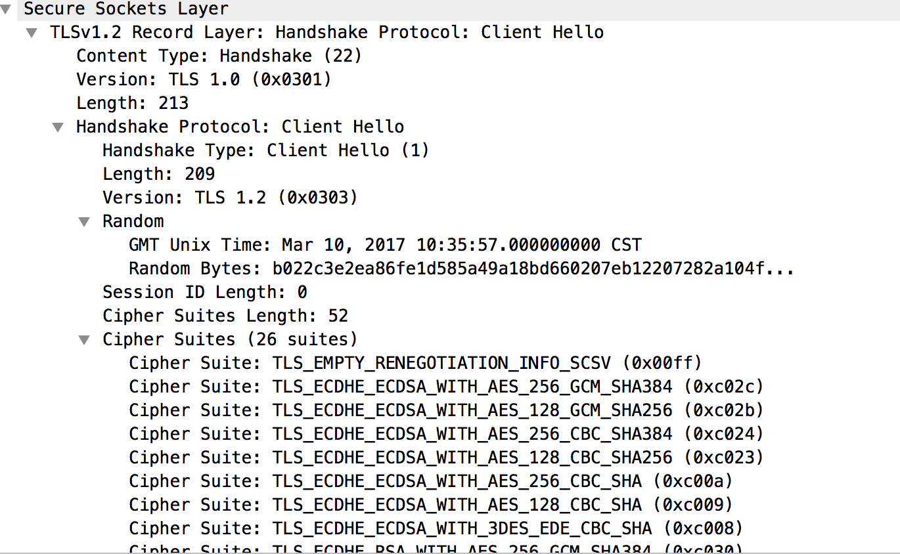
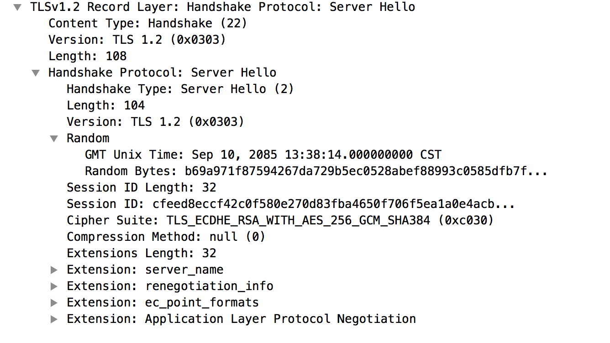
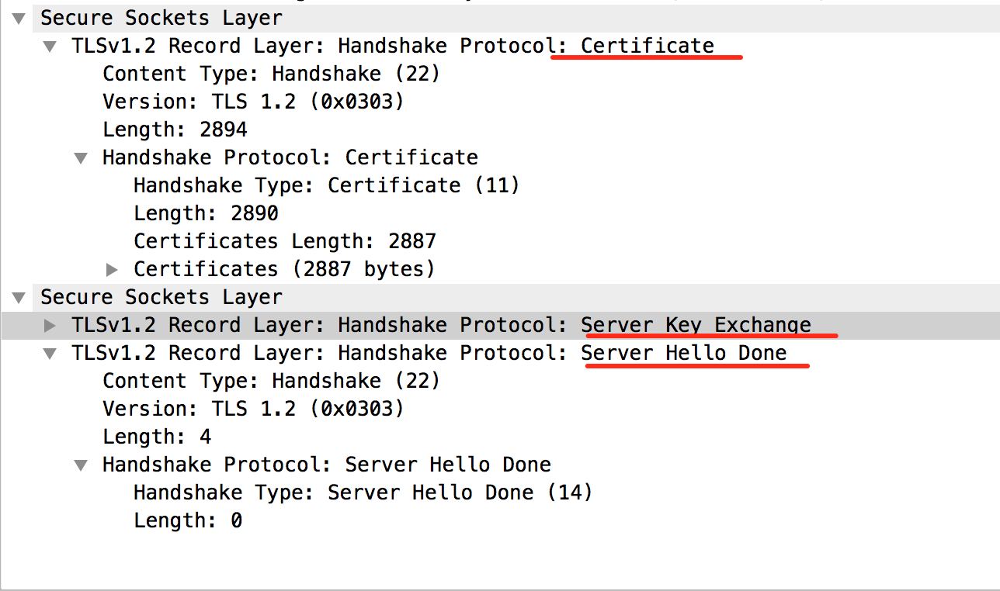
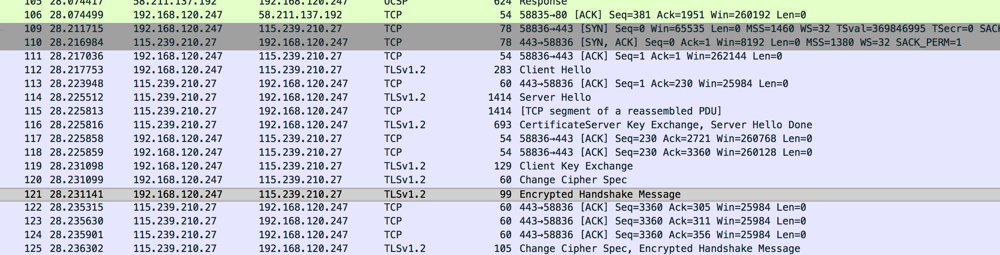

看了大半天，总算将https的整个握手过程都看的差不多了，之前网上看过很多资料，描述的都差不多，也让我对于整个过程有一个大致的概念了，但是我想知道的一些关键点都没讲出来，基本都是一笔带过，然后也就没有再继续找了，这次想起来，又重新找资料，找到两篇很详细的文章介绍了，其中第二篇还介绍了一些算法层次的内容，有兴趣研究的同学可以看看，我这边只是稍做简化并将它图形化了，让读者有一个更直观的感受。

参考文章：

[http://www.jianshu.com/p/a766bbf31417](http://www.jianshu.com/p/a766bbf31417)

[http://blog.csdn.net/zgwangbo/article/details/50889623](http://blog.csdn.net/zgwangbo/article/details/50889623)

废话不多说，直接po图：

对于之前了解过https过程的小伙伴，仔细看这个图应该会解开一些迷惑吧，仔细看！包括那些字母和脚标！但是！我还是稍微解释下吧，毕竟还是要凑点字数的......

概念的介绍啥的我就不说了，直接开始正文吧。

1.  ClientHello。 首先https请求是基于http的，也就是基于tcp的，所以先得建立tcp三次握手，这个就不说了，然后tcp握手后是SSL层的握手，也就是图中的ClientHello消息，client发送本地最新的TLS版本、算法组合的一个集合和其他很多辅助的信息，并且生成一个随机数A。具体的内容可以看下图（`ClientHello.png`）：

可以看到随机数（`Random`）是一个GMT UNIX时间加上一串随机字节，算法组合（`Cipher Suite`）有26种。还有ClientHello并不是我随便叫叫的，真的叫ClientHello😢......
2.  ServerHello。Server收到这些信息后比对自己的TLS版本，选择其中低的一个作为返回，并且从算法组合的集合中选出一种合适的组合，然后同样也生成一个随机数B，一起打包到ServerHello中传回给Client。内容如图（`ServerHello.png`）：

同样ServerHello也不是随便叫的，可以看到随机数格式和ClientHello一样，并且这里选出了一种CipherSuite算法组合。
3.  Certificatie,ServerHelloDone。服务端在选出沟通策略之后将自己的证书信息告诉Client端（`Certificate`），通知Client关于秘钥更新的信息（`ServerkeyExchange`），接下去就看你的了，并且表示该发的都发给你了，我的Hello结束了（`ServerHelloDone`）。

4.  Client收到2，3步的信息后先验证证书是不是合法的，包括它的颁发机构，域名匹配，有限期限等，这个具体的过程就不探究了，只要知道这些步骤就行了。

5.  证书验证通过之后，生成随机数C1,然后用证书内容中的公钥通过服务器选择的非对称加密算法加密，得出为C2。

6.  由之前的三个随机数A、B、C1通过一个伪随机函数再生成一个D，**注意！这个是最终http真正使用的加密秘钥！！！**。

7.  由D再次通过伪随机函数生成一个秘钥组，包含6个秘钥，假设为P1,P2,P3,P4,P5,P6。

8.  ClientKeyExchange。通知Server秘钥相关的信息，发送第5步中算出的C2给Server端。

9.  Client端发送ClientKeyExchange之后，计算之前所有与Server端交互消息的hash值，假设为client_hash1，用步骤7中得到的其中一个P1进行加密，结果为E。
10.  Server端收到C2后用私钥结合非对称算法解密C2，得到C1。

11.  同样的Server端也根据A、B、C1由伪随机函数生成D(**最终的加密秘钥！！！**),再由D得出秘组钥（P1-P6），因为这里涉及到的算法都是一样的，所以得出的秘钥也是一样的。

12.  Server端计算之前所有和Client端交互消息的hash值，假设为server_hash2，大家可能发现了，11、12跟Client端的6、7、9过程一致，只是少了9中的P1加密过程。

13.  这个时候Client端会发送ChangeCipherSpec消息和EncryptedHandshakeMessage消息，通知Server端接下去使用选定的加密策略来通信了，并且将第9步中的E传给了Server。（这里几个步骤的顺序只是为了好理解一点而这样排列，实际两条线是独立在处理信息的，所以先后顺序不能保证）

14.  这个时候Client会再次计算之前握手消息的hash值，得出结果client_hash2。

15.  Server在收到EncryptedHandshakeMessage消息带过来的E之后，利用步骤11中的P1解密E，由于加密算法和P1都是相同的，所以这里还原出了client_hash1，然后与步骤12中的server_hash2比对，如果一样说明之前的几条协商秘钥的消息都被对方正确无误的理解了。

16.  Server端再次对之前的消息做hash值，得出server_hash2，用P2进行加密结果为F，然后通过ChangeCipherSpec-EncryptedHandshakeMessage消息传给Client端。

17.  Client收到Server的消息后根据P2解密F还原得出server_hash2，与client_hash2比对如果一致，则认为之前的交互过程都是正确无误且被对方理解的。至此，整个握手过程就结束了，之后的http数据报就会被之前确定的加密策略和加密秘钥D进行加密传输了。

总结：其实最终我们发现整个握手过程中并没有直接传输最终的加密秘钥D，而且交换了一些算法策略和生成D的一些参数，这样相对来说会更安全一点，直接传D的话这个过程就由Client端完成了，中间如果出什么差错Server会无感知无条件的信任Client传过来的D，就有可能出现问题了，所以采用只传策略和参数，并且由双方共同参与，这样安全性和正确性就会提高很多。贴一张整个过程的抓包图作为结尾吧~
