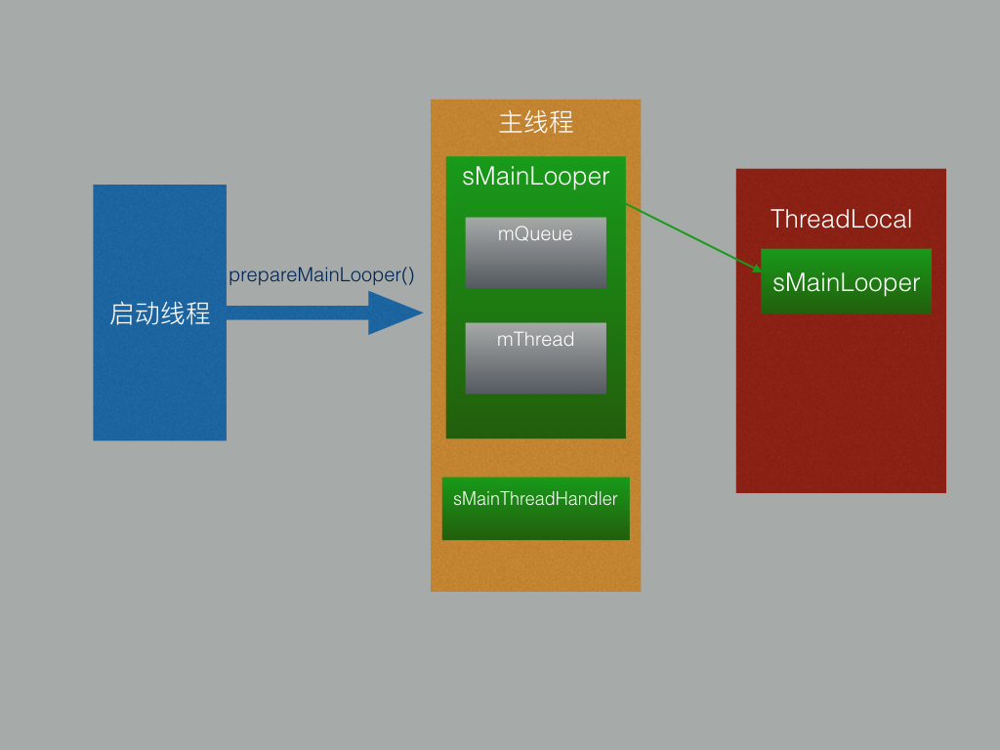
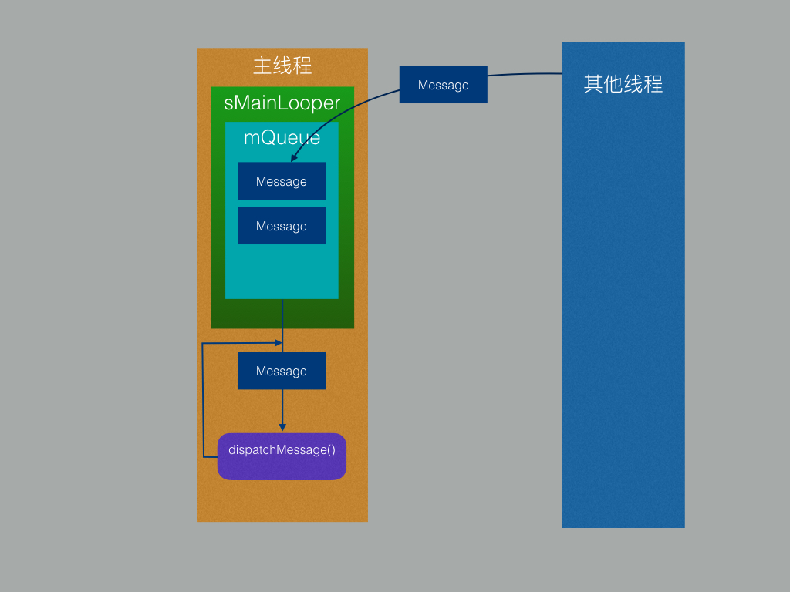

今天来扒一扒Android的消息分发机制和多线程切换过程，也就是我们常常看到用的Handler，Message（还有两个不太看得到的MessageQueue和Looper）它们的原理。额，当然有人会说还有AsyncTask这玩意儿，怎么说呢，反正我是基本没用过AsyncTask，也没见谁喜欢用这个，总感觉使用起来没Handler+Message方便，然而我用的更多的是Handler+Runnable，当然实际上Runnable还是被包装成了Message。

先简单介绍一下这几个类吧：

* **Handler:**
 
 	处理者，一般在主线程创建（在工作线程也可以创建，这个下一篇会详细说到），处理各种线程发送过来的* Message，根据Message内容在主线程做不同的处理。
* **Message:**

	消息体，在多线程中担任一个内容载体的角色，包含了消息的类型，参数，数据等内容，其中还包括一个重要的对象，那就是它将会被发送给那个handler。
* **MessageQueue：**

	消息队列，所有发送给handler处理的消息都会保存在消息队列中，其内部使用链表的形式维护这些message。
* **Looper：**
	
	这个怎么说呢，它的英文解释为一个打环的装置，我也不知道该怎么翻译，它的作用是可以让线程一直活着，而不是执行完一个功能代码后就死掉了，每个Looper的实例有一个MessageQueue和当前线程对象，正是这两个类让线程可以一直活着，也就是Looper打环的装置的意思吧。我们的主线程就是因为它才可以一直执行而不退出。

上面说到Looper使我们的主线程可以一直运行，究竟是咋回事，上代码！！！

```
 public static void main(String[] args) {
        ······
        Looper.prepareMainLooper();

        ActivityThread thread = new ActivityThread();
        thread.attach(false);

        if (sMainThreadHandler == null) {
            sMainThreadHandler = thread.getHandler();
        }
		······
        Looper.loop();

        throw new RuntimeException("Main thread loop unexpectedly exited");
    }
```
没错，就是我们的主线程初始化的地方，也就是应用程序启动的入口。我们的应用对于Android系统而言，说白了也就是一段程序代码，那么程序启动的时候当然得从启动方法开始了，它就是**ActivityThread**中大名鼎鼎的**main()**方法，是不是想起来java中的**main()**方法？我们来看一下这里到底做了哪些事。首先就是调用了**Looper**的静态方法**preoareMainLooper()**:

```
	/**
     * Initialize the current thread as a looper, marking it as an
     * application's main looper. The main looper for your application
     * is created by the Android environment, so you should never need
     * to call this function yourself.  See also: {@link #prepare()}
     */
    public static void prepareMainLooper() {
        prepare(false);
        synchronized (Looper.class) {
            if (sMainLooper != null) {
                throw new IllegalStateException("The main Looper has already been prepared.");
            }
            sMainLooper = myLooper();
        }
    }
```
 这个是源码原封不动的贴上来的，包括注释，可以看到这个方法应该由系统调用，它根据当前线程初始化一个**Looper**对象，并且是应用的"main looper"，也就是方法名所表现的，接着看方法里的第一行调用。

```
	private static void prepare(boolean quitAllowed) {
        if (sThreadLocal.get() != null) {
            throw new RuntimeException("Only one Looper may be created per thread");
        }
        sThreadLocal.set(new Looper(quitAllowed));
    }
    
    private Looper(boolean quitAllowed) {
        mQueue = new MessageQueue(quitAllowed);
        mThread = Thread.currentThread();
    }
```

这里有个**sThreadLocal**，它是一个静态属性：**static final ThreadLocal<Looper> sThreadLocal = new ThreadLocal<Looper>();**，也就是全局就一个，每个线程最多对应一个**Looper**对象，如果有，**Looper**对象都会保存在**sThreadLocal**中，我们简单的把它理解为一个Map就行，key为当前的线程，value为一个**Looper**实例，因为线程（也就是key）在方法调用的时候内部可以取到，所以对它进行get，set操作的时候不需要传key，直接传value就行，那么这个方法就很好理解了，如果之前调用过这个方法，**sThreadLocal.get()**则不为null,直接抛异常（也就说明了一个线程最多只能对应一个**Looper**对象），否则new一个**Looper**对象存到**sThreadLocal**中，**Looper**对象初始化的同时也初始化了一个**MessageQueue**，并且持有了当前线程的引用。

好，继续看**prepareMainLooper**方法，判断**sMainLooper**是否为null，第一次调用当然为null，所以**sMainLooper = myLooper();**

```
	/**
     * Return the Looper object associated with the current thread.  Returns
     * null if the calling thread is not associated with a Looper.
     */
    public static @Nullable Looper myLooper() {
        return sThreadLocal.get();
    }
```
很简单，直接调用**sThreadLocal.get()**方法，很眼熟是吧，我们刚刚调用过它的**set()**方法，这个时候还在刚才的线程中呢，所以这里取出来的就是我们刚刚放进去的**new Looper()**，可以稍微看一下这个过程中有个参数就**quitAllowed**，最终被传到了**MessageQueue**的构造器中，应该可以猜到它表示这个**MessageQueue**是否可以被退出或者说这个线程是否能被结束掉，当然因为我们的线程是主线程，所以传**false**。目前为止我们已经完成了**prepareMainLooper()**方法，它所做的事其实很简单，就是将我们的线程作为key在**sThreadLocal**中保存了一个不可退出的**Looper**对象，同时赋值给**sMainLooper**，为什么还要单独定义一个**sMainLooper**呢？首先**sMainLooper**是一个静态属性，且有一个**getMainLooper()**静态方法直接返回**sMainLooper**,所以我猜测是因为主线程的**Looper**对象获取比较频繁，所以单独作为一个属性直接读取，省的每次从**sThreadLocal**中去取，以此减小开销。

下面放一张图作为prepareMainLooper的总结吧，对着图看应该清晰很多：


回头继续看**main()**方法，接下去new了一个ActivityThread实例**thread**，并且调用了**attach()**方法，然后将**thread.getHandler()**返回给**sMainThreadHandler**，这几行代码主要是初始化了我们的应用进程和Android系统的通信基础，也就是Binder组件，使得我们的应用进程和Android系统能够通信，这里我们只要知道个大概，就是Android系统会发送消息给我们的应用的**ActivityThread**(好吧，其实是它的一个内部类**ApplicationThread**)，然后由**ActivityThread**包装成**Message**放入**sMainLooper**的**MessageQueue**中等待执行。如何执行，请往下看......

再接下去是**Looper.loop()**方法

```
	/**
     * Run the message queue in this thread. Be sure to call
     * {@link #quit()} to end the loop.
     */
    public static void loop() {
        final Looper me = myLooper();
        if (me == null) {
            throw new RuntimeException("No Looper; Looper.prepare() wasn't called on this thread.");
        }
        final MessageQueue queue = me.mQueue;
		······
        for (;;) {
            Message msg = queue.next(); // might block
            if (msg == null) {
                // No message indicates that the message queue is quitting.
                return;
            }

          	······

            msg.target.dispatchMessage(msg);

            ······

            msg.recycleUnchecked();
        }
    }
```
可以看到以上代码逻辑也十分简单，获取当前线程的**Looper**对象，进而获取**Looper**对象中的**MessageQueue**保存为**queue**，然后进入死循环，每次都从**queue**中取下一个**Message**，得到**Message**后直接调用**Message**对象中保存的目标**handler**的**dispatchMessage（）**方法，然后回收**Message**进入下一次循环。至此，我们的主线程才成为了真正意义上的主线程。上面说到Android系统会给我们应用发消息，然后消息被包装成**Message**保存在**MessageQueue**中，而在**loop()**方法中我们又去取下一个**Message**，是不是发现了什么？不错，我们应用中的各种系统方法的调用其实都是都将Android系统发送的消息包装成**Message**保存到我们的应用主线程绑定的**sMainLooper**中的**MessageQueue**中，然后由这个死循环从**MessageQueue**中取依次出**Message**消息进而执行对应的方法，这样一个完整的消息传递过程就打通了！

老样子，看图：


我个人认为以上内容已经是**Handler**和**Message**完成多线程切换和消息传递的核心内容了，主要也就是**Looper**类的用处和用法，看懂了这些内容再看整个流程会很轻松，所以如果还没理解的话建议再看几遍，或者直接去看看Looper的源码更好。

其实还一个比较关键的步骤：如何从**MessageQueue**取**Message**，不过个人感觉就算这个过程对于理解整个消息传递机制影响不大，只要知道**MessageQueue**以链表的形式维护这每个进入队列的**Message**就行了。有兴趣的小伙伴也可以看看源码，我就在这里贴一下**MessageQueue.next()**方法的源码吧：

```
	Message next() {
        // Return here if the message loop has already quit and been disposed.
        // This can happen if the application tries to restart a looper after quit
        // which is not supported.
        final long ptr = mPtr;
        if (ptr == 0) {
            return null;
        }

        int pendingIdleHandlerCount = -1; // -1 only during first iteration
        int nextPollTimeoutMillis = 0;
        for (;;) {
            if (nextPollTimeoutMillis != 0) {
                Binder.flushPendingCommands();
            }

            nativePollOnce(ptr, nextPollTimeoutMillis);

            synchronized (this) {
                // Try to retrieve the next message.  Return if found.
                final long now = SystemClock.uptimeMillis();
                Message prevMsg = null;
                Message msg = mMessages;
                if (msg != null && msg.target == null) {
                    // Stalled by a barrier.  Find the next asynchronous message in the queue.
                    do {
                        prevMsg = msg;
                        msg = msg.next;
                    } while (msg != null && !msg.isAsynchronous());
                }
                if (msg != null) {
                    if (now < msg.when) {
                        // Next message is not ready.  Set a timeout to wake up when it is ready.
                        nextPollTimeoutMillis = (int) Math.min(msg.when - now, Integer.MAX_VALUE);
                    } else {
                        // Got a message.
                        mBlocked = false;
                        if (prevMsg != null) {
                            prevMsg.next = msg.next;
                        } else {
                            mMessages = msg.next;
                        }
                        msg.next = null;
                        if (DEBUG) Log.v(TAG, "Returning message: " + msg);
                        msg.markInUse();
                        return msg;
                    }
                } else {
                    // No more messages.
                    nextPollTimeoutMillis = -1;
                }

                // Process the quit message now that all pending messages have been handled.
                if (mQuitting) {
                    dispose();
                    return null;
                }

                // If first time idle, then get the number of idlers to run.
                // Idle handles only run if the queue is empty or if the first message
                // in the queue (possibly a barrier) is due to be handled in the future.
                if (pendingIdleHandlerCount < 0
                        && (mMessages == null || now < mMessages.when)) {
                    pendingIdleHandlerCount = mIdleHandlers.size();
                }
                if (pendingIdleHandlerCount <= 0) {
                    // No idle handlers to run.  Loop and wait some more.
                    mBlocked = true;
                    continue;
                }

                if (mPendingIdleHandlers == null) {
                    mPendingIdleHandlers = new IdleHandler[Math.max(pendingIdleHandlerCount, 4)];
                }
                mPendingIdleHandlers = mIdleHandlers.toArray(mPendingIdleHandlers);
            }

            // Run the idle handlers.
            // We only ever reach this code block during the first iteration.
            for (int i = 0; i < pendingIdleHandlerCount; i++) {
                final IdleHandler idler = mPendingIdleHandlers[i];
                mPendingIdleHandlers[i] = null; // release the reference to the handler

                boolean keep = false;
                try {
                    keep = idler.queueIdle();
                } catch (Throwable t) {
                    Log.wtf(TAG, "IdleHandler threw exception", t);
                }

                if (!keep) {
                    synchronized (this) {
                        mIdleHandlers.remove(idler);
                    }
                }
            }

            // Reset the idle handler count to 0 so we do not run them again.
            pendingIdleHandlerCount = 0;

            // While calling an idle handler, a new message could have been delivered
            // so go back and look again for a pending message without waiting.
            nextPollTimeoutMillis = 0;
        }
    }

```
本来只想写一篇的，不过感觉好像有点长了，这样的话就再写一篇吧，这篇就当做是理论知识的一个补充，接下去讲讲顺着实际应用过程的线索，一步步是如何将消息放入**MessageQueue**到最后执行的~
